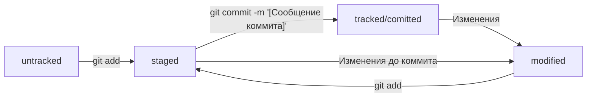

# Основы работы с командной строкой, Git и GitHub

командная строка = терминал = консоль  


2 варианта обозначения для систем контроля версия:
* VCS (Version control system)
* SCM (Strong control managment) - система управления исходным кодом

**Ревизия** = **версия** - одно или группа изменений    
Содержит `inf` о том:
* Что изменилось   
* Кто внес изменения   
* Когда это было  


---
## Шпаргалка по основным командам командной строки


### Перемещение по папкам и их просмотр

```
$ pwd - выводит рабочую директорию 
```

```
$ сd ~ - переход к домашней директории
```

```
$ ls - вывести содержимое директории  
```

```
$ ls -a - вывести расширенный список, в котором отображаются все скрытые файлы, которые начинаются с .  
```

```
$ cd имя_папки -  меняет текущую директорию на ту, которая указана в качестве параметра  
```

```
$ .. - вернуться в родительскую директорию  
```


### Создание файлов и директорий

```
$ touch имя_файла - создать файл
```

```
$ touch my-new-file.txt
```

```
$ mkdir имя_файла (от англ. make directory) - создаёт директорию
```

```
$ mkdir -p имя_папки1/имя_папки2/имя_папки3 - создаёт структуру директорий
```

```
$ touch ../../file.txt - создаст файл file.txt на две папки выше по иерархии
```


### Копирование файлов

```
$ ср что_копируем куда_копируем - копирует файл
```

```
$ сp index.html srс/ - скопировали index.html в папку
```

_можно несколько_  
```
$ что_копируем что_копируем куда_копируем
```

### Перемешенне файлов и палок

```
$ mv имя_файла1_или_папки1 ... куда_перемещаем - перемещает файл или папку в папку
```

### Чтение файлов

```
$ cat имя_файла - распечатает то, что содержится в файле
```

### Удаление файлов и папок

Все команды удаления стирают данные `безвозвратно` - их **нельзя** будет восстановить из корзины

```
$ rm имя_файла - для удалення файла
```

```
$ rmdir имя_файла - для удалення пустой директории
```

```
$ rm -r имя_файла - для удаления директории с файлами. Удаляет данные рекурсивно
```

### Выполнение нескольких команд  

Можно выполнять команды не по одной, а сразу списком. Для этого они разделяются двумя амперсантами `&&`.

```
$ cd Desktop && mkdir first-project
```

### Команды из буфера обмена  

Чтобы обратиться к последней команде, нажмите (`↑`) - возвращает к последней, а затем предпоследней команде
(`↓`) - от предпоследней к последней

```
$ ↑ - автоматически подставит последнюю команду
```

```
$ [Тав] - дописывает не только команды, но и пути
```

```
$ cd ~/[Tab] - вывели список директорий, чтобы понять, куда переходить
```
Applications/   Downloads/   Library/      Parallels/    Dropbox/  
Movies/         Pictures/    Documents/    Desktop/      Music/  
Exercism/       Postman/     Public/       bin/          books/  

Если вывод синком большой, нужно нажать: `y`(yes) или `n`(no)

### Перемещение в самую верхнюю папку

_MacOs_  
```
$ cd / - перемещает в корневую директорию (самую верхнюю папку)
```
_Windows_  
```
$ cd с:/  или   $ cd /с
```
---


## Шпаргалка по основным командам Git

`коммит` - это одна из основных сущностей в gіt. Коммит гарантирует, что изменения будут сохранены в истории и к ним можно будет „откатиться". Это как если бы мы могли выполнить ctrl + z для целой папки (репозитория)  

### Сделать папку репозиторием

```
$ cd ~/Desktop/first-project 
$ git init - создали репозиторий
```

### "Разгитить" папку, если что-то пошло не так

```
rm -rf .git (r(om англ. recursive) и f(om англ. force))
```
### Как связать локальный и удаленный репозитории
### Подготовить файлы к сохранению

```
$ git add todolist.txt - подготовит todolit к сохранению
```

```
$ git add --all - подготовит все файлы к сохранению
```

```
$ git add . - подготовит всю папку к сохранению
```
### Выполнить коммит

Сделать коммит можно командой `git commit` c ключом `-m` (от англ. **message** — «сообщение»), который присваивает коммиту сообщение.
```
$ git commit -m 'Мой первый коммит!'
```
Команда `git commit` выведет _информацию_ о коммите.  
[master (root-commit) baa3b6e] значит: 
* коммит был в ветке master;
* root-commit — это самый первый, или «корневой» (англ. root), коммит в ветке, у следующих коммитов такой надписи не будет;
* baa3b6e — сокращённый идентификатор коммита.


### Как оформлять сообщения к коммитам
### Хеш — идентификатор коммита
* **Хеш** — основной идентификатор коммита и позволяет узнать его автора, дату и содержимое закоммиченных файлов.
* Все хеши, а также таблицу соответствий `хеш → информация` о коммите Git хранит в папке .git.

### Журнал записей log
```
$ git log - выведет лог (журнал записей), где хранится вся история коммитов
```
Элементы, из которых состоит описание:  
* строка из цифр и латинских букв после слова commit — это хеш коммита;
* Author — имя автора и его электронная почта;
* Date — дата и время создания коммита;
* в конце находится сообщение коммита.

```
$ git log --oneline - выведет сокращённый лог
```
В терминале появятся только первые несколько символов хеша каждого коммита и их комментарии. Сокращённый хеш (то есть первые несколько символов полного) можно использовать точно так же, как и полный. 

### Типичный жизненный цикл файла в Git



### Про статусы файлов в Git

* `untracked` - Git «видит», что такой файл существует, но не следит за изменениями в нём. У untracked-файла нет предыдущих версий, зафиксированных в коммитах или через команду `git add`.
* `staged` -  После выполнения команды `git add` файл попадает в staging area, то есть в список файлов, которые войдут в коммит.
* `modified` - Состояние `modified` означает, что Git сравнил содержимое файла с последней сохранённой версией и нашёл отличия.
* `tracked` - Состояние `tracked` — это противоположность `untracked`. Оно довольно широкое по смыслу: в него попадают все файлы, кроме тех, которые еще не отслеживаются.

### Проверить состояние репозитория

```
$ git status
```


